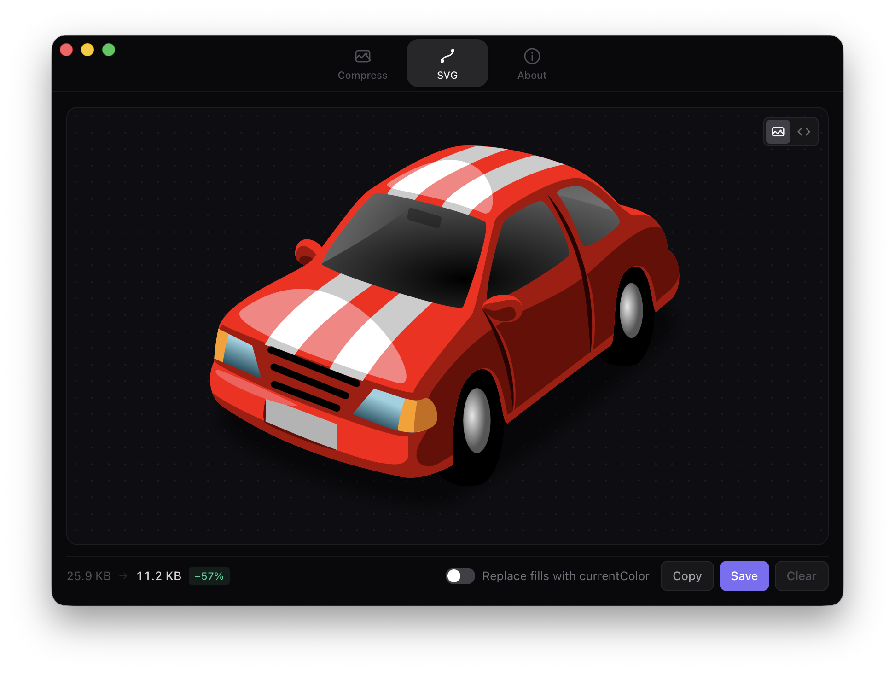

<div align="center">
  
  <h1>Visionary</h1>
  <p>Image &amp; SVG tools for web developers — fast, offline, native macOS.</p>
  
  
  
  <br /><br />
  
</div>

---

## What it does

Visionary is a lightweight macOS desktop app for the two most common image chores in web development: compressing raster images and optimizing SVGs. Everything runs locally — no uploads, no accounts, no internet required.

### Compress
Drop in JPG or PNG files and convert them to WebP or AVIF in one click. Optionally scale images down to a maximum dimension before encoding. Processes up to 3 files concurrently with live progress feedback and a per-file size reduction summary.

### SVG
Drop in an SVG and Visionary runs it through [SVGO](https://github.com/svg/svgo) — stripping comments, collapsing redundant groups, and removing unnecessary attributes. Toggle **Replace fills with currentColor** to make icons inherit color from CSS. Preview the result visually or inspect the cleaned-up markup in Code View, then copy to clipboard or save in place.

---

## Download

1. Go to the [**Releases**](../../releases) page
2. Download `Visionary-mac.zip` from the latest release
3. Unzip and drag **Visionary.app** to your `/Applications` folder

> **First launch — Gatekeeper warning**
>
> Because Visionary is not notarized with an Apple Developer certificate, macOS will block it on first open. To allow it:
>
> Right-click (or Control-click) **Visionary.app** → **Open** → click **Open** in the dialog.
>
> You only need to do this once. After that it opens normally.

---

## Build from source

**Prerequisites:** [Rust](https://rustup.rs), [Node.js](https://nodejs.org) 18+

```bash
git clone https://github.com/yourusername/visionary.git
cd visionary
npm install
npm run dev        # launch in development mode with HMR
npm run build      # build release .app
```

The release bundle will be at:
```
src-tauri/target/release/bundle/macos/Visionary.app
```

---

## Tech

| Layer | Library |
|-------|---------|
| Shell | [Tauri 2](https://tauri.app) |
| UI | React 18 + TypeScript + Tailwind CSS |
| SVG optimization | SVGO 3 |
| Image encoding | `image` + `webp` + `ravif` (Rust) |
| Bundler | Vite |
